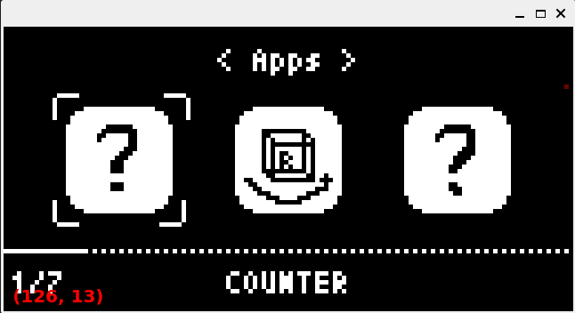

# PixelUI

A lightweight **C++ UI framework** for resource-constrained embedded devices (e.g. ESP32).  
PixelUI provides a **modular, event-driven, and component-based** UI system with smooth rendering and animations powered by [U8G2](https://github.com/olikraus/u8g2).  
Its design focuses on **performance, low memory footprint, and easy extensibility**, enabling developers to build complex UIs with minimal effort.

---



## ✨ Features

- 🎛 **Core Scheduler**: Event-driven architecture with `Heartbeat()` for logic & animation updates and `renderer()` for drawing.
- 🎞 **Animation Engine**: Fixed-point easing curves, protected animations, and centralized management via `AnimationManager`.
- 📚 **View & Input Management**: Stack-based navigation, popup routing, and strict input priority handling.
- 🧩 **Component-Based Widgets**: Unified `Widget` base class for reusable UI elements (`Brace`, `Histogram`, etc.).
- 📜 **ListView**: Smooth scrolling menus with sub-items, actions, and configurable options.
- 🚀 **Resource Optimized**: Minimal heap usage, separate rendering & logic loops, and stable long-term operation.

---

## 🏗 Architecture

### Core
- **PixelUI**: Entry point and central dispatcher.
- **Heartbeat**: Advances animations, timers, and state updates.
- **Renderer**: Draws the current UI to display buffer.

### Animation
- **AnimationManager** manages animations with shared pointers.
- **Fixed-point arithmetic** ensures predictable performance on MCUs without FPU.
- **Protected animations** survive bulk cleanup operations.

### Views & Input
- **ViewManager**: Stack-based view management (`push`, `pop`).
- **PopupManager**: Modal dialogs get highest input priority.
- **Input routing**: Only unhandled events reach active view.

### Components
- **Widget** base class: Defines `onLoad`, `onOffload`, and `draw`.
- **ListView**: Scrollable menu supporting:
  - Submenus
  - Executable items
  - Configurable boolean/integer options
- **AppManager**: Registers apps, sorts by priority, and generates app launcher views.

### Resource Strategy
- Minimized dynamic memory allocation to avoid fragmentation.
- Logic (`Heartbeat`) and rendering (`renderer`) fully separated.

---

## 📦 Getting Started

#Third-Party Dependencies (Git Submodules)
- This project uses the following Git submodules, placed under third_party/:
    - ETL (Embedded Template Library)
    - U8G2

Initialize/update submodules after clone:

```bash
git submodule update --init --recursive
```

# Build simulator
- To build the PC Qt6 simulator, ensure the following option exists in the root CMakeLists.txt (default ON):
```bash
option(BUILD_SIMULATOR "Build PC Qt simulator" ON)
```

- You can also set it via CMake command line:
```bash
cmake -B build -S . -DBUILD_SIMULATOR=ON
cmake --build build
```

```cpp
#include <U8g2lib.h>
#include "PixelUI.h"

U8G2 u8g2(...);
PixelUI ui(u8g2);

// Update logic (called every ~16ms, e.g. from a timer/RTOS task)

void TimerElapsedISR() { // assuming trigger every 16ms, provide ~ 60FPS frame rate at most.
    ui.Heartbeat(16);
}

int main() {
    // Create your main app
    auto mainApp = std::make_shared<MainApp>(ui);
    ui.getViewManager().push(mainApp);

    while(true) {
        // Render UI (can be lower priority task)
        ui.renderer();

        // Handle input
        if (auto event = readInput()) {
            ui.handleInput(event.value());
        }
    }
}


## 📜 License

PixelUI is released under the **GNU General Public License v3.0 (GPL-3.0)**.  
This means you are free to use, modify, and redistribute PixelUI, but **any derivative work must also be licensed under GPLv3**.

👉 See the [LICENSE](./LICENSE) file for the full license text, or visit:  
[https://www.gnu.org/licenses/gpl-3.0.html](https://www.gnu.org/licenses/gpl-3.0.html)