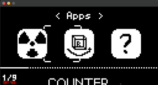

# PixelUI

**DEVELOPMENT PAUSED**

This project is temporarily paused due to my preparation for the postgraduate entrance examination(until Dec. 2026).
If you find this project interesting, please notice that:
- No new features will be added during this period.
- Issues and PRs may not be responded to in time.

---

This is a lightweight **C++ animated UI & app framework** for resource-constrained embedded devices (e.g. ESP32).  
PixelUI provides a **modular, event-driven, and component-based** UI system with smooth rendering and animations powered by [U8G2](https://github.com/olikraus/u8g2).  
Its design focuses on **performance, low memory footprint, and easy extensibility**, enabling developers to build complex UIs with minimal effort.

---



## 🏗 Architecture

### Core
- **PixelUI**: Entry point and central dispatcher, including input routing and animations, etc.
- **Renderer**: Draws the current UI to display buffer.
- **AnimationManager** manages animations with shared pointers. using Fixed-point arithmetic ensures predictable performance on MCUs without FPU. Supports protected animations, survive bulk cleanup operations.
- **Coroutine** A light-weight coroutine implementation, useful when writing animation load sequence.
- **ViewManager**: Stack-based view management.

### Components
- **Widget** versatile widget system, supports custom widgets with animations and interactions.
- **ListView**: Scrollable menu supporting:
  - Submenus
  - Executable items
  - Configurable boolean/integer options
- **IconView**: Scrollable menu, displays item icon for selection.
- **AppLauncher**: Implementation of IconView, coupled with AppSystem to acquire all registered apps.
- **Popup**: PopupManagers, Popup base and interface, Popup derivations
- **Focus**: Focus system for widget choosing.
- **Blinker**: To achieve Non-blocking blink.

### Resource Strategy
- Minimized dynamic memory allocation to avoid fragmentation.
- Logic (`Heartbeat`) and rendering (`renderer`) fully separated.

## 📦 Getting Started

#Third-Party Dependencies (Git Submodules)
- This project uses the following Git submodules, placed under **third_party/**:
    - ETL (Embedded Template Library)
    - U8G2

Initialize/update submodules after clone to download them under **third_party/** :

```bash
git submodule update --init --recursive
```

# Build simulator
- To build the PC Qt6 simulator, ensure the following option exists in the root CMakeLists.txt (default ON):
```bash
option(BUILD_SIMULATOR "Build PC Qt simulator" ON)
```

- You can also set it via CMake command line:
```bash
cmake -B build -S . -DBUILD_SIMULATOR=ON
cmake --build build
```

> Check out wiki page to see how to adapt PixelUI to your system!

## 📜 License

PixelUI is released under the **GNU General Public License v3.0 (GPL-3.0)**.  
This means you are free to use, modify, and redistribute PixelUI, but **any derivative work must also be licensed under GPLv3**.

👉 See the [LICENSE](./LICENSE) file for the full license text, or visit:  

[https://www.gnu.org/licenses/gpl-3.0.html](https://www.gnu.org/licenses/gpl-3.0.html)
